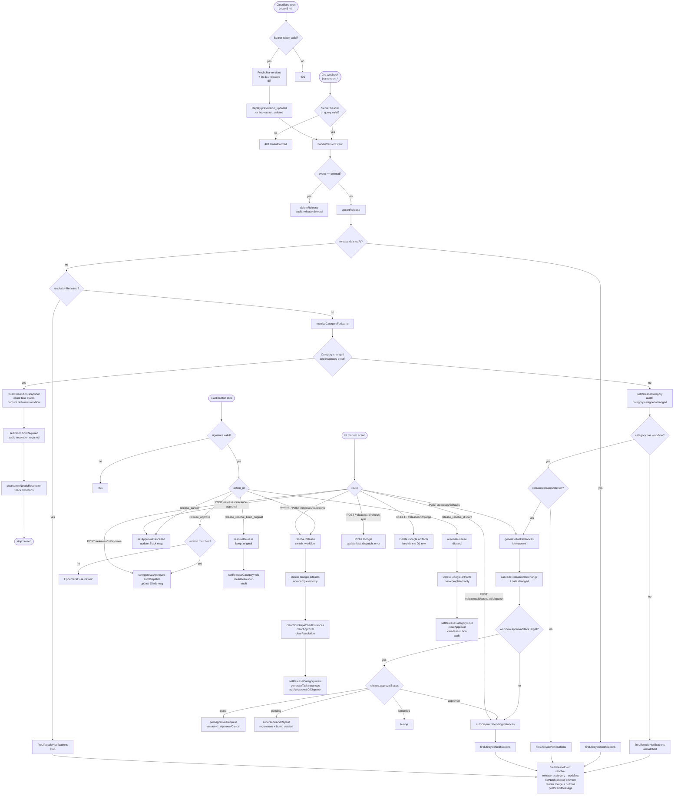

# Release Flow

End-to-end architecture of the release management pipeline: Jira version webhooks → D1 storage → **category lookup** → **workflow**-driven task generation → approval gating → dispatch to Google → Slack notifications. Plus a resolution flow for category-change conflicts and a cron-based recovery loop for missed webhooks.

> **Maintenance note**: Keep this doc in sync when changing any file listed in the [File Map](#file-map) below. The mermaid diagram and text description should both reflect current behavior. When a branch or state is added/removed, update both.

## Purpose

Automate the "release checklist" workflow: when a Jira version hits a release date, materialize a pre-defined set of tasks (Google Tasks + Calendar events), optionally gate dispatch behind Slack approval, and push subsequent date changes through to the already-created Google resources. When Jira renames a release into a different category after tasks exist, freeze automation and prompt the admin to choose how to reconcile.

## Model

```
release ── category_id ──▶ release_category ── workflow_id ──▶ workflow
                                                                 │
                                                                 ├── workflow_tasks (ordered)
                                                                 ├── workflow_notifications (event-driven)
                                                                 └── approval_slack_target (optional gate)
```

- **Release**: mirror of a Jira version + app-side state (category_id, approval, resolution).
- **Release category**: an exhaustive (platform, release-type) lookup row. 6 seeded: `web-{major,minor,patch}`, `android-{major,minor,patch}`. Unique on `(platform_prefix, release_type)`, so each release matches at most one.
- **Workflow**: the single unit of automation. Owns an ordered task list, notification rules, and an optional approval Slack target. A category can be assigned a workflow (or left unassigned — matching releases stay unmatched).
- **Workflow task**: either inline (full definition stored on the row) or linked to a library `task_definition` (locked fields use the library value; configurable fields can be overridden).
- **Task instance**: concrete row materialized per (release, workflow task) with a real due date, status, and external ref. What the UI renders and the dispatcher reads.

## High-Level Flow (Mermaid)



## Text Description

### 1. Entry Points

1. **Jira webhook** → `POST /api/webhooks/jira/version` — primary. Fires on every version lifecycle event.
2. **Cron recovery** → `POST /api/cron/recover` — called every 5 minutes by a Cloudflare Worker. Reconciles Jira ↔ D1 and replays missed events. See [Cron Recovery](#11-cron-recovery).
3. **Slack interactive** → `POST /api/webhooks/slack/interactive` — approval buttons + resolution buttons.
4. **UI manual action** → endpoints under `/api/releases/[id]/*` — fallbacks when webhook or Slack path fails.

All live paths delegate to `handleVersionEvent` in `lib/releases/orchestrator.ts`, which is the single state machine for release ingestion.

### 2. Webhook Auth & Event Routing

`app/api/webhooks/jira/version/route.ts` — accepts `X-Webhook-Secret` header OR `?secret=` query param. Rejects in production if unset.

Event types recognized:
- `jira:version_created`, `updated`, `released`, `unreleased`, `moved`, `merged` → upsert path through orchestrator
- `jira:version_deleted` → soft-delete + audit event

### 3. Release Storage

All release rows live in Cloudflare D1 via `lib/releases/store.ts`. Key mutators:

- `upsertRelease` — idempotent insert/update from webhook payload. Never touches category or resolution state (the orchestrator owns those).
- `deleteRelease` — soft delete (sets `deletedAt`).
- `purgeRelease` — hard delete.
- `setReleaseCategory` — pin a release to a category.
- `setResolutionRequired` / `clearResolution` — freeze / unfreeze the release around category conflicts.
- `setApprovalPending/Approved/Cancelled` + `bumpApprovalVersion` — approval state machine with stale-click protection.

A release carries four parallel state flags:
- **Jira state**: `released`, `archived`, `deletedAt`.
- **Category state**: `categoryId` (nullable when unmatched).
- **Resolution state**: `resolutionRequired`, `resolutionReason`, `resolutionSnapshot`.
- **Approval state**: `none` | `pending` | `approved` | `cancelled`.

### 4. Category Resolution

Parsing: `parseReleaseName(name)` → `{ platform, releaseType }` from `{platform}@{semver}`. `resolveCategoryForName` looks up `release_category WHERE platform_prefix = ? AND release_type = ?`. Unique constraint on `(platform_prefix, release_type)` guarantees at most one match.

Outcomes:
- No match → release becomes unmatched (`category_id = NULL`). No tasks, no notifications, no approvals fire. UI prompts to fix the Jira name or adjust categories.
- Match with no assigned workflow → "unmatched" for automation purposes, but the category is written so re-assigning the workflow later lights everything up.
- Match with a workflow → continue to task generation.

### 5. Category-Change Conflict Detection

`lib/releases/orchestrator.ts` — after upsert, the orchestrator re-resolves the category. If the category changed **and** any task instances already exist, we don't silently swap workflows (that'd orphan Google resources). Instead:

1. Build a `ResolutionSnapshot` capturing old category + old workflow, new category + new workflow, and counts of pending/dispatched/completed instances.
2. `setResolutionRequired` with reason `category_changed`. This is an in-band flag — until cleared, the orchestrator short-circuits before generate/cascade/dispatch on every subsequent event.
3. Post an admin alert (`postAdminNeedsResolution`) to `releaseAdminSlackTarget` with three buttons: Keep original / Switch workflow / Discard all. Confirmations are built into the Slack blocks.
4. Render a resolution banner + three-card decision UI on `/releases/[id]` that mirrors the Slack prompt.

The user can resolve from either surface; both paths call `resolveRelease` in `lib/releases/resolution.ts`. See [Resolution](#10-resolution).

### 6. Task Instance Generation

`lib/releases/task-instances-store.ts`. One row per workflow task, materialized with:

- `dueDate = addDays(release.releaseDate, task.dayOffset)`.
- For workflow tasks linked to a library `task_definition`, locked fields use the definition's value and configurable fields can be overridden via the task's `overrides` JSON.
- `label` and `description` rendered with merge fields (`{{release.name}}`, `{{task.dueDate}}`, etc.) from `lib/releases/merge-fields.ts`.

`generateTaskInstances` is idempotent: if any instances exist, it skips. `regenerateTaskInstances` deletes non-dispatched rows (preserves anything with an `external_id`) and creates a fresh set. `clearNonDispatchedInstances` deletes all non-dispatched rows (used during resolution).

### 7. Approval Gate

Configured per-workflow in `workflow.approval_slack_target`. When set, dispatch is gated behind a Slack message with Approve / Cancel buttons.

Logic after task generation (orchestrator's `applyApprovalOrDispatch`):

| Current status | Action |
|---|---|
| no target set | `autoDispatchPendingInstances` |
| `none` | `postApprovalRequest` → status `pending`, version 1 |
| `pending` (release updated while waiting) | `supersedeAndRepost` → mark old msg "superseded", bump version, post new msg |
| `approved` | skip gate, `autoDispatchPendingInstances` |
| `cancelled` | no-op — user explicitly declined |

**Stale-click guard** (`app/api/webhooks/slack/interactive/route.ts`): each approval message encodes `{releaseId}:{approvalVersion}`. Clicks on superseded messages show an ephemeral "use the newer message" and don't mutate state.

### 8. Dispatch to Google

`lib/releases/dispatcher.ts`. Per-instance dispatch (`dispatchInstance`):

- `manual` → mark `done`, no remote call.
- `google_task` → `createGoogleTask(taskListId, title, notes, dueDate)` → store `externalId` + URL → status `done`.
- `calendar_event` → requires `dueDate`. `createCalendarEvent(calendarId, summary, description, date, time, duration, timezone)`.

Idempotency: if `externalId` is already set, dispatch is skipped. Errors are written to `last_dispatch_error` on the instance and fire a `task.failed` notification event.

### 9. Date Change Cascade

`cascadeReleaseDateChange` runs whenever the release date changes after instances exist. Per instance:

1. Compute `newDueDate = addDays(newReleaseDate, dayOffset)`.
2. If no `externalId` → update local only.
3. If Google not connected → update local + record drift error.
4. If `google_task`:
   - Remote completed → mark instance `done`, don't reschedule.
   - Remote missing → clear `externalId`, record drift.
   - Remote pending → `updateGoogleTaskDue` + update local.
5. If `calendar_event`:
   - Remote missing/cancelled → clear `externalId`, record drift.
   - New date null → local only.
   - Otherwise → `updateCalendarEventDate` + update local.

### 10. Resolution

`lib/releases/resolution.ts` exposes `resolveRelease({ releaseId, action })` used by both the Slack interactive handler and the in-app POST `/api/releases/[id]/resolve`. Actions:

- **`keep_original`** — pin `category_id` back to the snapshot's old category, clear the freeze, audit.
- **`switch_workflow`** — delete Google artifacts for non-completed instances (preserves completed ones as history), clear non-dispatched rows, pin `category_id` to the new category, clear approval state, clear the freeze, regenerate from the new workflow, re-apply the approval gate (or auto-dispatch).
- **`discard`** — delete Google artifacts for non-completed instances, clear non-dispatched rows, null out `category_id`, clear approval state, clear the freeze. Release becomes unmatched.

All three write to `release_events` so the resolution choice is visible in the audit log.

### 11. Cron Recovery

A **separate** Cloudflare Worker at `cron/` runs every 5 minutes, calls `POST /api/cron/recover` on the Next.js app with a shared bearer token. The recovery endpoint:

1. Fetches all versions from Jira's REST API for the configured project.
2. Lists all non-deleted releases from D1.
3. For every Jira version with any material difference vs. the D1 row → replays `jira:version_updated` through `handleVersionEvent`.
4. For every D1 release not present in Jira's list → replays `jira:version_deleted`.

`handleVersionEvent` is idempotent, so replaying an already-accurate event is a no-op beyond a few reads. This closes gaps left by dropped webhooks without adding a parallel code path.

### 12. Slack Notifications

Separate from approval + admin messages. Configured per-workflow in `workflow_notifications`.

Event types (`ReleaseEventType`):
- `release.created`, `release.date_changed`, `release.released`, `task.failed`, `release.needs_resolution`.

For each event, `fireReleaseEvent` walks release → category → workflow, fetches matching rules for the event type, renders merge fields, builds Block Kit payload, posts via `chat.postMessage`. Errors are swallowed so one failing notification doesn't break the webhook. Unmatched releases fire nothing — the admin alert path covers those.

### 13. UI Surfaces & Manual Overrides

- `/releases` — list view with sync summary pills, unmatched count, pending-approval count.
- `/releases/[id]` — detail page. Surfaces:
  - Resolution banner + 3 decision cards when `resolutionRequired`.
  - Unmatched banner when no category or no workflow.
  - Approval banner (pending/cancelled) with manual Approve/Cancel fallback.
  - Phase-grouped task table with per-row retry / push-to-google.
- `/releases/workflows` — list, create, edit workflows (tasks + notifications + approval target).
- `/releases/categories` — 6-row table mapping categories to workflows.
- `/releases/task-library` — shared task definitions with configurable-field locking.
- `/settings` — OAuth connections (Google, Slack), **admin alert target** (for resolution prompts), timezone.

## File Map

| Concern | Path |
|---|---|
| Jira webhook ingestion | `app/api/webhooks/jira/version/route.ts` |
| Cron recovery endpoint | `app/api/cron/recover/route.ts` |
| Cron worker (separate deploy) | `cron/src/worker.ts` |
| Slack interactive (approve/cancel/resolve) | `app/api/webhooks/slack/interactive/route.ts` |
| Orchestrator (state machine) | `lib/releases/orchestrator.ts` |
| Resolution logic | `lib/releases/resolution.ts` |
| Release storage (D1) | `lib/releases/store.ts` |
| Categories | `lib/releases/categories.ts` |
| Workflows + tasks + notifications | `lib/releases/workflows-store.ts` |
| Task definitions (library) | `lib/releases/task-definitions-store.ts` |
| Task instances (materialization) | `lib/releases/task-instances-store.ts` |
| Audit log | `lib/releases/events-store.ts` |
| Name parsing | `lib/releases/matcher.ts` |
| Merge fields | `lib/releases/merge-fields.ts` |
| Approval helpers | `lib/releases/approval.ts` |
| Approval Slack message | `lib/releases/approval-message.ts` |
| Admin resolution alert | `lib/releases/admin-notifier.ts` |
| Dispatch + cascade | `lib/releases/dispatcher.ts` |
| Notifications fan-out | `lib/releases/notifications.ts` |
| Slack Block Kit builder | `lib/releases/notification-blocks.ts` |
| Google Tasks / Calendar client | `lib/google/client.ts` |
| Jira versions fetch (recovery) | `lib/jira/versions.ts` |
| KV config (admin target, tz) | `lib/config.ts` |
| Types | `lib/releases/types.ts` |
| Manual endpoints | `app/api/releases/[id]/*` |
| Workflows/categories API | `app/api/releases/workflows/*`, `app/api/releases/categories/route.ts` |
| UI — list | `app/releases/page.tsx` |
| UI — detail | `app/releases/[id]/page.tsx` |
| UI — workflows | `app/releases/workflows/*` |
| UI — categories | `app/releases/categories/page.tsx` |
| UI — task library | `app/releases/task-library/*` |
| UI — Slack target picker | `components/releases/SlackTargetPicker.tsx` |
| Migration | `migrations/0012_workflows_refactor.sql` |

## External Dependencies

| Service | Purpose | Credentials |
|---|---|---|
| Jira Cloud | Version webhook source + REST (recovery) | `JIRA_URL`, `JIRA_EMAIL`, `JIRA_API_TOKEN`, `JIRA_WEBHOOK_SECRET`, `JIRA_PROJECT_KEY` |
| Google Tasks | Create/update/read tasks | OAuth (stored server-side) |
| Google Calendar | Create/update/read events | OAuth (stored server-side) |
| Slack | Approval, admin, notifications + interactive callbacks | `SLACK_BOT_TOKEN`, `SLACK_SIGNING_SECRET` |
| Cloudflare D1 | Release / workflow / instance / event storage | Workers binding |
| Cloudflare KV | Dashboard + admin alert config | `CLOUDFLARE_API_TOKEN`, `CLOUDFLARE_ACCOUNT_ID`, `CLOUDFLARE_KV_NAMESPACE_ID` |
| Cloudflare Worker (cron) | Scheduled drift recovery | `CRON_RECOVERY_SECRET`, `APP_URL` (worker-side) |

## Key Idempotency Points

1. **Upsert** — webhooks can safely retry; same `version.id` merges rather than duplicating.
2. **Category assignment** — derived deterministically from release name; re-running produces the same result.
3. **Task generation** — skipped if any instance already exists for the release.
4. **Dispatch** — skipped if `externalId` is already set on the instance.
5. **Approval clicks** — version-gated; stale clicks rejected with ephemeral message.
6. **Cron replay** — orchestrator no-ops when nothing material changed, so replaying the entire project every 5 min is cheap.
