# Release Flow

End-to-end architecture of the release management pipeline: Jira version webhooks → D1 storage → template matching → task instance generation → approval gating → dispatch to Google → Slack notifications.

> **Maintenance note**: Keep this doc in sync when changing any file listed in the [File Map](#file-map) below. The mermaid diagram and text description should both reflect current behavior. When a branch or state is added/removed, update both.

## Purpose

Automate the "release checklist" workflow: when a Jira version hits a release date, materialize a pre-defined set of tasks (Google Tasks + Calendar events), optionally gate dispatch behind Slack approval, and push subsequent date changes through to the already-created Google resources.

## High-Level Flow (Mermaid)

```mermaid
flowchart TD
    %% ENTRY POINTS
    JiraWH([Jira webhook<br/>jira:version_*])
    SlackBtn([Slack button click])
    SlackAppMention([Slack @mention app_mention - approvals])
    UIManual([UI: manual dispatch / approve / purge])

    %% WEBHOOK ROUTING
    JiraWH --> AuthCheck{Secret header<br/>or query valid?}
    AuthCheck -- no --> Reject401[401 Unauthorized]
    AuthCheck -- yes --> EventRoute{webhookEvent}

    EventRoute -- jira:version_deleted --> SoftDelete[deleteRelease<br/>set deletedAt]
    EventRoute -- version_created/updated/<br/>released/unreleased/moved/merged --> Upsert[upsertRelease<br/>D1]

    %% AFTER UPSERT
    Upsert --> DateChangeCheck{releaseDate<br/>newly set or changed?}
    DateChangeCheck -- no --> FireEvents1[fireReleaseEvent<br/>created / released]
    DateChangeCheck -- yes --> MaybeGen[maybeGenerateInstances]

    MaybeGen --> InstancesExist{Any task<br/>instances exist?}
    InstancesExist -- no --> Match[matchTemplates<br/>by platform + version]
    Match --> Collect[collectResolvedTasks<br/>dedupe by definitionId:offset]
    Collect --> Generate[generateTaskInstances<br/>dueDate = releaseDate + dayOffset<br/>render merge fields]
    Generate --> Cascade

    InstancesExist -- yes --> Cascade[cascadeReleaseDateChange]

    %% CASCADE LOGIC
    Cascade --> CascadeLoop[For each instance]
    CascadeLoop --> HasExt{externalId set?}
    HasExt -- no --> LocalOnly[setTaskInstanceDueDate<br/>local only]
    HasExt -- yes --> GCreds{Google<br/>credentials?}
    GCreds -- no --> LocalOnlyErr[Update local<br/>+ record 'Google not connected']
    GCreds -- yes --> ActionType{actionType}

    ActionType -- google_task --> GTStatus{remote status}
    GTStatus -- completed --> MarkDoneLocal[updateTaskInstanceStatus done]
    GTStatus -- missing --> ClearExt1[Clear externalId<br/>record drift error]
    GTStatus -- pending --> UpdateGT[updateGoogleTaskDue<br/>+ local due_date]

    ActionType -- calendar_event --> CEStatus{remote status}
    CEStatus -- missing/cancelled --> ClearExt2[Clear externalId<br/>record drift error]
    CEStatus -- exists + dueDate null --> LocalOnlyCal[Update local only<br/>Calendar cannot be undated]
    CEStatus -- exists + dueDate set --> UpdateCE[updateCalendarEventDate<br/>+ local due_date]

    ActionType -- manual --> LocalOnly

    %% APPROVAL BRANCH (after generate, before dispatch)
    Cascade --> ApprovalGate{approval target<br/>configured in KV?}
    ApprovalGate -- no --> AutoDispatch[autoDispatchPendingInstances]
    ApprovalGate -- yes --> ApprovalStatus{approvalStatus}

    ApprovalStatus -- none --> PostApproval[postApprovalRequest<br/>Slack message w/ Approve/Cancel<br/>set status=pending version=1]
    ApprovalStatus -- pending --> Supersede[supersedeAndRepost<br/>mark old msg superseded<br/>bump version repost]
    ApprovalStatus -- approved --> AutoDispatch
    ApprovalStatus -- cancelled --> NoOpCancel[No-op<br/>user said no]

    %% SLACK INTERACTIVE
    SlackBtn --> SigVerify{signature<br/>valid?}
    SigVerify -- no --> Reject401Slack[401]
    SigVerify -- yes --> StaleCheck{clicked version ==<br/>current approvalVersion?}
    StaleCheck -- no --> EphemeralStale[Ephemeral: use newer message]
    StaleCheck -- yes --> BtnAction{action_id}
    BtnAction -- release_approve --> Approve[setApprovalApproved<br/>update Slack msg to 'Approved by @user']
    BtnAction -- release_cancel --> Cancel[setApprovalCancelled<br/>update Slack msg to 'Cancelled by @user']
    BtnAction -- release_view --> AckOnly[ack only URL button]

    Approve --> AutoDispatch

    %% DISPATCH
    AutoDispatch --> DispatchLoop[For each pending instance]
    DispatchLoop --> AlreadyExt{externalId<br/>already set?}
    AlreadyExt -- yes --> Idempotent[Skip - idempotent]
    AlreadyExt -- no --> ActionTypeD{actionType}
    ActionTypeD -- manual --> MarkDone[Mark done<br/>no remote call]
    ActionTypeD -- google_task --> CreateGT[createGoogleTask<br/>setTaskInstanceExternalRef<br/>status=done]
    ActionTypeD -- calendar_event --> HasDate{dueDate present?}
    HasDate -- no --> DispatchErr[setTaskInstanceDispatchError]
    HasDate -- yes --> CreateCE[createCalendarEvent<br/>setTaskInstanceExternalRef<br/>status=done]

    CreateGT -- error --> FailEvent[fireReleaseEvent<br/>task.failed]
    CreateCE -- error --> FailEvent

    %% NOTIFICATIONS
    FireEvents1 --> NotifFan[notifications.ts<br/>match templates → rules<br/>render blocks → chat.postMessage]
    Generate --> FireEvents2[fireReleaseEvent<br/>date_changed if previousDate differed]
    FireEvents2 --> NotifFan
    FailEvent --> NotifFan

    %% UI MANUAL PATHS
    UIManual --> ManualRoutes{route}
    ManualRoutes -- POST /releases/:id/approve --> Approve
    ManualRoutes -- POST /releases/:id/cancel-approval --> Cancel
    ManualRoutes -- POST /releases/:id/tasks/:tid/dispatch --> DispatchLoop
    ManualRoutes -- POST /releases/:id/refresh-sync --> RefreshSync[Probe Google<br/>update last_dispatch_error]
    ManualRoutes -- DELETE /releases/:id/purge --> Purge[Delete Google resources<br/>hard-delete D1 rows]
```

## Text Description

### 1. Entry Points

Three ways a release flow can be triggered:

1. **Jira webhook** → `POST /api/webhooks/jira/version` — the primary entry point. Fires on every version lifecycle event.
2. **Slack interactive** → `POST /api/webhooks/slack/interactive` — approval button clicks.
3. **UI manual action** → endpoints under `/api/releases/[id]/*` — fallbacks when webhook delivery fails or a user needs to override.

### 2. Webhook Auth & Event Routing

`app/api/webhooks/jira/version/route.ts:45-52` — accepts `X-Webhook-Secret` header OR `?secret=` query param. Falls back to permissive dev mode if `JIRA_WEBHOOK_SECRET` is unset.

Event types recognized:
- `jira:version_created`, `updated`, `released`, `unreleased`, `moved`, `merged` → upsert path
- `jira:version_deleted` → soft-delete (sets `deletedAt`, preserves row for audit)

### 3. Release Storage

All release rows live in Cloudflare D1 via `lib/releases/store.ts`. Key mutation functions:

- `upsertRelease` (L136-171) — idempotent insert/update from webhook payload
- `deleteRelease` (L178-184) — soft delete
- `purgeRelease` (L192-194) — hard delete (cascade to task instances)
- `setApprovalPending/Approved/Cancelled` (L60-117) — approval state machine
- `bumpApprovalVersion` (L79-90) — increments on supersede for stale-click protection

A release carries two parallel state flags:
- **Jira state**: `released`, `archived`, `deletedAt`
- **Approval state**: `none` | `pending` | `approved` | `cancelled`

### 4. Template Matching

Triggered when a release first gets a date (`maybeGenerateInstances`). `lib/releases/matcher.ts:14-76`:

1. Parse release name `{platform}@{major}.{minor}.{patch}` (e.g., `web@1.2.0`).
2. Classify as `major` / `minor` / `patch` release type.
3. Match against all templates: each template has `platformPrefixes` and `releaseTypes` filters (empty = wildcard).
4. Sort matches by `priority ASC`.

### 5. Task Instance Generation

`lib/releases/templates-store.ts:773-915`. One row per task per release, materialized with:

- `dueDate = addDays(release.releaseDate, task.dayOffset)`
- `label` and `description` rendered with merge fields (`{{release.name}}`, `{{release.date}}`, etc.) from `lib/releases/merge-fields.ts:26-43`
- Deduped by `{definitionId}:{dayOffset}` across templates — the task library lets a definition be reused with locked or overrideable fields.

Generation is idempotent: if any instances exist for the release, generation is skipped.

### 6. Approval Gate

Configured via `releaseApprovalSlackTarget` in Cloudflare KV (`lib/config.ts:8-14`). When set, dispatch is gated behind a Slack message with Approve / Cancel buttons.

Logic after task generation (`app/api/webhooks/jira/version/route.ts:150-170`):

| Current status | Action |
|---|---|
| `none` + has instances | `postApprovalRequest` → status = `pending`, version = 1 |
| `pending` (release updated while waiting) | `supersedeAndRepost` → mark old msg "superseded", bump version, post new msg |
| `approved` | skip gate, `autoDispatchPendingInstances` |
| `cancelled` | no-op — user explicitly declined |

**Stale-click guard** (`app/api/webhooks/slack/interactive/route.ts:163-177`): each approval message encodes `{releaseId}:{approvalVersion}`. Clicks on superseded messages show an ephemeral "use the newer message" and do not mutate state.

### 7. Dispatch to Google

`lib/releases/dispatcher.ts`. Per-instance dispatch (`dispatchInstance`, L78-125):

- `manual` → mark `done`, no remote call.
- `google_task` → `createGoogleTask(taskListId, title, notes, dueDate)` → store `externalId` + URL → status `done`.
- `calendar_event` → requires `dueDate`. `createCalendarEvent(calendarId, summary, description, date, time, duration, timezone)`.

Idempotency: if `externalId` is already set, dispatch is skipped. Errors are written to `last_dispatch_error` on the instance and fire a `task.failed` notification event.

### 8. Date Change Cascade

`cascadeReleaseDateChange` (`lib/releases/dispatcher.ts:165-259`) runs whenever the release date changes after instances exist. Per instance:

1. Compute `newDueDate = addDays(newReleaseDate, dayOffset)` (or null if date cleared).
2. If no `externalId` → update local only.
3. If Google not connected → update local + record drift error.
4. If `google_task`:
   - Remote completed → mark instance `done`, don't reschedule (honors user action).
   - Remote missing → clear `externalId`, record drift.
   - Remote pending → `updateGoogleTaskDue` + update local.
5. If `calendar_event`:
   - Remote missing/cancelled → clear `externalId`, record drift.
   - New date null → local only (Calendar events cannot be "undated").
   - Otherwise → `updateCalendarEventDate` + update local.

### 9. Slack Notifications

Separate from approval messages. Configured per-template in the notification rules table.

`lib/releases/notifications.ts:43-103`. Event types (`lib/releases/types.ts:48-52`):

- `release.created` — first time seeing this version ID
- `release.date_changed` — date was null then set, or moved
- `release.released` — Jira marks released
- `task.failed` — dispatch error for an instance

For each event, matched templates' notification rules are fanned out: merge fields rendered, Slack Block Kit payload built (`notification-blocks.ts`), posted via `chat.postMessage` with `SLACK_BOT_TOKEN`. Errors are swallowed so one failing notification doesn't break the webhook.

Notifications always post a **new** message — they never edit an existing one. The only messages that are edited in place are approval messages (on approve/cancel/supersede).

### 10. UI Surfaces & Manual Overrides

- `/releases` — list view with sync summary pills.
- `/releases/[id]` — detail page: task table, sync state per row, manual dispatch, approve/cancel, refresh sync, push drifted row to Google, purge soft-deleted.
- `/releases/templates` — manage templates, ordering, notification rules.
- `/releases/task-library` — shared task definitions with configurable-field locking.
- `/settings` — OAuth connections (Google, Slack), approval target, timezone.

### 11. Cron / Scheduled Recovery

Currently **none**. Missed webhooks recover only via the manual "Refresh Sync" button. This is a known gap — a periodic reconciliation job would close it.

## File Map

| Concern | Path |
|---|---|
| Jira webhook ingestion | `app/api/webhooks/jira/version/route.ts` |
| Slack interactive (approve/cancel) | `app/api/webhooks/slack/interactive/route.ts` |
| Release storage (D1) | `lib/releases/store.ts` |
| Templates + task instances | `lib/releases/templates-store.ts` |
| Template matching | `lib/releases/matcher.ts` |
| Merge fields | `lib/releases/merge-fields.ts` |
| Approval helpers | `lib/releases/approval.ts` |
| Approval Slack message | `lib/releases/approval-message.ts` |
| Dispatch + cascade | `lib/releases/dispatcher.ts` |
| Notifications fan-out | `lib/releases/notifications.ts` |
| Slack Block Kit builder | `lib/releases/notification-blocks.ts` |
| Google Tasks client | `lib/google/tasks.ts` |
| Google Calendar client | `lib/google/calendar.ts` |
| KV config (approval target, tz) | `lib/config.ts` |
| Types | `lib/releases/types.ts` |
| Manual endpoints | `app/api/releases/[id]/*` |
| UI — list | `app/releases/page.tsx` |
| UI — detail | `app/releases/[id]/page.tsx` |
| UI — templates | `app/releases/templates/page.tsx` |
| UI — task library | `app/releases/task-library/page.tsx` |
| UI — Slack target picker | `components/releases/SlackTargetPicker.tsx` |

## External Dependencies

| Service | Purpose | Credentials |
|---|---|---|
| Jira Cloud | Version webhook source + REST API | `JIRA_URL`, `JIRA_EMAIL`, `JIRA_API_TOKEN`, `JIRA_WEBHOOK_SECRET` |
| Google Tasks | Create/update/read tasks | OAuth (stored server-side) |
| Google Calendar | Create/update/read events | OAuth (stored server-side) |
| Slack | Approval messages + notifications + interactive callbacks | `SLACK_BOT_TOKEN`, `SLACK_SIGNING_SECRET` |
| Cloudflare D1 | Release / template / instance storage | Workers binding |
| Cloudflare KV | Dashboard + approval config | `CLOUDFLARE_API_TOKEN`, `CLOUDFLARE_ACCOUNT_ID`, `CLOUDFLARE_KV_NAMESPACE_ID` |

## Key Idempotency Points

1. **Upsert** — webhooks can safely retry; same `version.id` merges rather than duplicating.
2. **Task generation** — skipped if any instance already exists for the release.
3. **Dispatch** — skipped if `externalId` is already set on the instance.
4. **Approval clicks** — version-gated; stale clicks rejected with ephemeral message.
